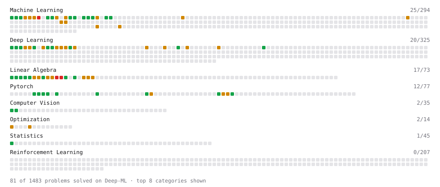

# Deep-ML

My machine learning practice from [Deep-ML](https://www.deep-ml.com). Every solution here was written by hand.

**100** solved · 94 problems · 3 labs · 3 math

[**Browse the interactive portfolio**](https://HanhaiNotHai.github.io/deep-ml/) to replay this filling in over time.

## Problems

| | Difficulty | Solved | |
| --- | --- | --- | --- |
| [Batch a TensorDataset with DataLoader](https://www.deep-ml.com/problems/1237) | easy | 2026-09-28 | [solution](problems/1237-batch-a-tensordataset-with-dataloader) |
| [Batch Iterator for Dataset](https://www.deep-ml.com/problems/30) | easy | 2024-08-02 | [solution](problems/0030-batch-iterator-for-dataset) |
| [Build a Dataset and Use It with a DataLoader](https://www.deep-ml.com/problems/899) | easy | 2026-09-28 | [solution](problems/0899-build-a-dataset-and-use-it-with-a-dataloader) |
| [Build a Linear Regression Model with nn.Module](https://www.deep-ml.com/problems/885) | easy | 2026-09-28 | [solution](problems/0885-build-a-linear-regression-model-with-nn-module) |
| [Build an MLP with nn.Sequential](https://www.deep-ml.com/problems/887) | easy | 2026-09-28 | [solution](problems/0887-build-an-mlp-with-nn-sequential) |
| [Calculate 2x2 Matrix Inverse](https://www.deep-ml.com/problems/8) | easy | 2024-07-29 | [solution](problems/0008-calculate-2x2-matrix-inverse) |
| [Calculate Accuracy Score](https://www.deep-ml.com/problems/36) | easy | 2024-08-02 | [solution](problems/0036-calculate-accuracy-score) |
| [Calculate Covariance Matrix](https://www.deep-ml.com/problems/10) | easy | 2024-07-25 | [solution](problems/0010-calculate-covariance-matrix) |
| [Calculate Image Brightness](https://www.deep-ml.com/problems/70) | easy | 2025-10-23 | [solution](problems/0070-calculate-image-brightness) |
| [Calculate Mean by Row or Column](https://www.deep-ml.com/problems/4) | easy | 2024-07-25 | [solution](problems/0004-calculate-mean-by-row-or-column) |
| [Compute Multi-class Cross-Entropy Loss](https://www.deep-ml.com/problems/134) | easy | 2026-09-29 | [solution](problems/0134-compute-multi-class-cross-entropy-loss) |
| [Convert Vector to Diagonal Matrix](https://www.deep-ml.com/problems/35) | easy | 2024-08-02 | [solution](problems/0035-convert-vector-to-diagonal-matrix) |
| [Cosine LR Schedule with Linear Warmup](https://www.deep-ml.com/problems/910) | easy | 2026-10-09 | [solution](problems/0910-cosine-lr-schedule-with-linear-warmup) |
| [Count Parameters of a Sequential Model](https://www.deep-ml.com/problems/1218) | easy | 2026-09-28 | [solution](problems/1218-count-parameters-of-a-sequential-model) |
| [Derivatives of Activation Functions](https://www.deep-ml.com/problems/217) | easy | 2026-09-29 | [solution](problems/0217-derivatives-of-activation-functions) |
| [Early Stopping Based on Validation Loss Plateau](https://www.deep-ml.com/problems/199) | easy | 2026-10-09 | [solution](problems/0199-early-stopping-based-on-validation-loss-plateau) |
| [Early Stopping with Patience](https://www.deep-ml.com/problems/913) | easy | 2026-10-09 | [solution](problems/0913-early-stopping-with-patience) |
| [Feature Scaling Implementation](https://www.deep-ml.com/problems/16) | easy | 2024-07-31 | [solution](problems/0016-feature-scaling-implementation) |
| [Grayscale Image Contrast Calculator](https://www.deep-ml.com/problems/82) | easy | 2025-10-23 | [solution](problems/0082-grayscale-image-contrast-calculator) |
| [Implement Dropout from Scratch](https://www.deep-ml.com/problems/901) | easy | 2026-09-30 | [solution](problems/0901-implement-dropout-from-scratch) |
| [Implement Early Stopping Based on Validation Loss](https://www.deep-ml.com/problems/135) | easy | 2026-10-09 | [solution](problems/0135-implement-early-stopping-based-on-validation-loss) |
| [Implement F-Score Calculation for Binary Classification](https://www.deep-ml.com/problems/61) | easy | 2026-07-01 | [solution](problems/0061-implement-f-score-calculation-for-binary-classification) |
| [Implement LayerNorm from Scratch](https://www.deep-ml.com/problems/908) | easy | 2026-09-30 | [solution](problems/0908-implement-layernorm-from-scratch) |
| [Implement Precision Metric](https://www.deep-ml.com/problems/46) | easy | 2026-07-01 | [solution](problems/0046-implement-precision-metric) |
| [Implement Recall Metric in Binary Classification](https://www.deep-ml.com/problems/52) | easy | 2026-07-01 | [solution](problems/0052-implement-recall-metric-in-binary-classification) |
| [Implement ReLU Activation Function](https://www.deep-ml.com/problems/42) | easy | 2026-07-01 | [solution](problems/0042-implement-relu-activation-function) |
| [Implement Ridge Regression Loss Function](https://www.deep-ml.com/problems/43) | easy | 2026-07-01 | [solution](problems/0043-implement-ridge-regression-loss-function) |
| [Implementation of Log Softmax Function](https://www.deep-ml.com/problems/39) | easy | 2026-06-30 | [solution](problems/0039-implementation-of-log-softmax-function) |
| [KL Divergence Between Two Normal Distributions](https://www.deep-ml.com/problems/56) | easy | 2026-07-01 | [solution](problems/0056-kl-divergence-between-two-normal-distributions) |
| [Leaky ReLU Activation Function](https://www.deep-ml.com/problems/44) | easy | 2026-07-01 | [solution](problems/0044-leaky-relu-activation-function) |
| [Linear Kernel Function](https://www.deep-ml.com/problems/45) | easy | 2026-07-01 | [solution](problems/0045-linear-kernel-function) |
| [Linear Regression Using Gradient Descent](https://www.deep-ml.com/problems/15) | easy | 2024-07-29 | [solution](problems/0015-linear-regression-using-gradient-descent) |
| [Linear Regression Using Normal Equation](https://www.deep-ml.com/problems/14) | easy | 2024-07-29 | [solution](problems/0014-linear-regression-using-normal-equation) |
| [Matrix-Vector Dot Product](https://www.deep-ml.com/problems/1) | easy | 2024-07-25 | [solution](problems/0001-matrix-vector-dot-product) |
| [One SGD Update Step](https://www.deep-ml.com/problems/1234) | easy | 2026-09-28 | [solution](problems/1234-one-sgd-update-step) |
| [One-Hot Encoding of Nominal Values](https://www.deep-ml.com/problems/34) | easy | 2024-08-02 | [solution](problems/0034-one-hot-encoding-of-nominal-values) |
| [Random Shuffle of Dataset](https://www.deep-ml.com/problems/29) | easy | 2024-08-01 | [solution](problems/0029-random-shuffle-of-dataset) |
| [Reshape Matrix](https://www.deep-ml.com/problems/3) | easy | 2024-07-25 | [solution](problems/0003-reshape-matrix) |
| [Run One Training Step: Forward, Loss, Backward, Optimizer](https://www.deep-ml.com/problems/886) | easy | 2026-09-28 | [solution](problems/0886-run-one-training-step-forward-loss-backward-optimizer) |
| [Save and Load Model Weights with state_dict](https://www.deep-ml.com/problems/888) | easy | 2026-09-28 | [solution](problems/0888-save-and-load-model-weights-with-state-dict) |
| [Scalar Multiplication of a Matrix](https://www.deep-ml.com/problems/5) | easy | 2024-07-26 | [solution](problems/0005-scalar-multiplication-of-a-matrix) |
| [Sigmoid Activation Function Understanding](https://www.deep-ml.com/problems/22) | easy | 2024-08-01 | [solution](problems/0022-sigmoid-activation-function-understanding) |
| [Single Neuron](https://www.deep-ml.com/problems/24) | easy | 2024-08-01 | [solution](problems/0024-single-neuron) |
| [Softmax Activation Function Implementation ](https://www.deep-ml.com/problems/23) | easy | 2024-08-01 | [solution](problems/0023-softmax-activation-function-implementation) |
| [StepLR Learning Rate Scheduler](https://www.deep-ml.com/problems/153) | easy | 2026-10-09 | [solution](problems/0153-steplr-learning-rate-scheduler) |
| [Transformation Matrix from Basis B to C](https://www.deep-ml.com/problems/27) | easy | 2024-08-01 | [solution](problems/0027-transformation-matrix-from-basis-b-to-c) |
| [Transpose of a Matrix](https://www.deep-ml.com/problems/2) | easy | 2024-07-25 | [solution](problems/0002-transpose-of-a-matrix) |
| [2D Translation Matrix Implementation](https://www.deep-ml.com/problems/55) | medium | 2026-07-01 | [solution](problems/0055-2d-translation-matrix-implementation) |
| [BatchNorm1d Forward in Eval Mode](https://www.deep-ml.com/problems/1231) | medium | 2026-09-30 | [solution](problems/1231-batchnorm1d-forward-in-eval-mode) |
| [Calculate Eigenvalues of a Matrix](https://www.deep-ml.com/problems/6) | medium | 2024-07-26 | [solution](problems/0006-calculate-eigenvalues-of-a-matrix) |
| [CosineAnnealingLR Learning Rate Scheduler](https://www.deep-ml.com/problems/155) | medium | 2026-10-09 | [solution](problems/0155-cosineannealinglr-learning-rate-scheduler) |
| [Derivative of Cross-Entropy Loss w.r.t. Logits](https://www.deep-ml.com/problems/220) | medium | 2026-09-30 | [solution](problems/0220-derivative-of-cross-entropy-loss-w-r-t-logits) |
| [Derivative of Softmax](https://www.deep-ml.com/problems/219) | medium | 2026-09-29 | [solution](problems/0219-derivative-of-softmax) |
| [Divide Dataset Based on Feature Threshold](https://www.deep-ml.com/problems/31) | medium | 2024-08-02 | [solution](problems/0031-divide-dataset-based-on-feature-threshold) |
| [Dropout in Train vs Eval Mode](https://www.deep-ml.com/problems/1230) | medium | 2026-09-30 | [solution](problems/1230-dropout-in-train-vs-eval-mode) |
| [Dropout Layer](https://www.deep-ml.com/problems/151) | medium | 2026-09-30 | [solution](problems/0151-dropout-layer) |
| [Elbow Method for K-Means](https://www.deep-ml.com/problems/827) | medium | 2026-06-26 | [solution](problems/0827-elbow-method-for-k-means) |
| [Gauss-Seidel Method for Solving Linear Systems](https://www.deep-ml.com/problems/57) | medium | 2026-07-01 | [solution](problems/0057-gauss-seidel-method-for-solving-linear-systems) |
| [Generate Random Subsets of a Dataset](https://www.deep-ml.com/problems/33) | medium | 2026-07-01 | [solution](problems/0033-generate-random-subsets-of-a-dataset) |
| [Gradient Accumulation Over Micro-Batches](https://www.deep-ml.com/problems/912) | medium | 2026-10-09 | [solution](problems/0912-gradient-accumulation-over-micro-batches) |
| [Gradient Clipping by Norm](https://www.deep-ml.com/problems/909) | medium | 2026-10-09 | [solution](problems/0909-gradient-clipping-by-norm) |
| [Image Segmentation via K-Means Clustering](https://www.deep-ml.com/problems/832) | medium | 2026-06-26 | [solution](problems/0832-image-segmentation-via-k-means-clustering) |
| [Implement Adam Optimization Algorithm](https://www.deep-ml.com/problems/49) | medium | 2026-07-01 | [solution](problems/0049-implement-adam-optimization-algorithm) |
| [Implement AdamW Optimizer Step](https://www.deep-ml.com/problems/169) | medium | 2026-09-28 | [solution](problems/0169-implement-adamw-optimizer-step) |
| [Implement Batch Normalization for BCHW Input](https://www.deep-ml.com/problems/115) | medium | 2026-09-30 | [solution](problems/0115-implement-batch-normalization-for-bchw-input) |
| [Implement BatchNorm2d from Scratch (training mode)](https://www.deep-ml.com/problems/902) | medium | 2026-09-30 | [solution](problems/0902-implement-batchnorm2d-from-scratch-training-mode) |
| [Implement Gradient Descent Variants with MSE Loss](https://www.deep-ml.com/problems/47) | medium | 2026-07-01 | [solution](problems/0047-implement-gradient-descent-variants-with-mse-loss) |
| [Implement Group Normalization](https://www.deep-ml.com/problems/126) | medium | 2026-09-30 | [solution](problems/0126-implement-group-normalization) |
| [Implement K-Fold Cross-Validation](https://www.deep-ml.com/problems/18) | medium | 2024-07-31 | [solution](problems/0018-implement-k-fold-cross-validation) |
| [Implement K-Means++ Initialization](https://www.deep-ml.com/problems/362) | medium | 2026-06-25 | [solution](problems/0362-implement-k-means-initialization) |
| [Implement Layer Normalization for Sequence Data](https://www.deep-ml.com/problems/109) | medium | 2026-09-30 | [solution](problems/0109-implement-layer-normalization-for-sequence-data) |
| [Implement Long Short-Term Memory (LSTM) Network](https://www.deep-ml.com/problems/59) | medium | 2026-07-01 | [solution](problems/0059-implement-long-short-term-memory-lstm-network) |
| [Implement Mini-Batch K-Means](https://www.deep-ml.com/problems/363) | medium | 2026-06-26 | [solution](problems/0363-implement-mini-batch-k-means) |
| [Implement Reduced Row Echelon Form (RREF) Function](https://www.deep-ml.com/problems/48) | medium | 2026-07-01 | [solution](problems/0048-implement-reduced-row-echelon-form-rref-function) |
| [Implement RMSProp Optimizer](https://www.deep-ml.com/problems/200) | medium | 2026-09-30 | [solution](problems/0200-implement-rmsprop-optimizer) |
| [Implement Self-Attention Mechanism](https://www.deep-ml.com/problems/53) | medium | 2026-07-01 | [solution](problems/0053-implement-self-attention-mechanism) |
| [Implementing a Simple RNN](https://www.deep-ml.com/problems/54) | medium | 2026-07-01 | [solution](problems/0054-implementing-a-simple-rnn) |
| [Implementing Basic Autograd Operations](https://www.deep-ml.com/problems/26) | medium | 2024-08-01 | [solution](problems/0026-implementing-basic-autograd-operations) |
| [Instance Normalization (IN) Implementation](https://www.deep-ml.com/problems/143) | medium | 2026-09-30 | [solution](problems/0143-instance-normalization-in-implementation) |
| [K-Means Clustering](https://www.deep-ml.com/problems/17) | medium | 2024-07-31 | [solution](problems/0017-k-means-clustering) |
| [Matrix times Matrix ](https://www.deep-ml.com/problems/9) | medium | 2024-07-26 | [solution](problems/0009-matrix-times-matrix) |
| [Matrix Transformation ](https://www.deep-ml.com/problems/7) | medium | 2024-07-26 | [solution](problems/0007-matrix-transformation) |
| [Numerical Gradient Checking](https://www.deep-ml.com/problems/313) | medium | 2026-09-30 | [solution](problems/0313-numerical-gradient-checking) |
| [Numerically Stable Cross-Entropy](https://www.deep-ml.com/problems/914) | medium | 2026-10-09 | [solution](problems/0914-numerically-stable-cross-entropy) |
| [One Adam Update Step](https://www.deep-ml.com/problems/1236) | medium | 2026-09-28 | [solution](problems/1236-one-adam-update-step) |
| [One Training Step](https://www.deep-ml.com/problems/1219) | medium | 2026-09-28 | [solution](problems/1219-one-training-step) |
| [Principal Component Analysis (PCA) Implementation](https://www.deep-ml.com/problems/19) | medium | 2024-07-31 | [solution](problems/0019-principal-component-analysis-pca-implementation) |
| [SGD with Momentum Step](https://www.deep-ml.com/problems/1235) | medium | 2026-09-28 | [solution](problems/1235-sgd-with-momentum-step) |
| [Simple Convolutional 2D Layer](https://www.deep-ml.com/problems/41) | medium | 2026-07-01 | [solution](problems/0041-simple-convolutional-2d-layer) |
| [Single Neuron with Backpropagation](https://www.deep-ml.com/problems/25) | medium | 2024-08-01 | [solution](problems/0025-single-neuron-with-backpropagation) |
| [Solve Linear Equations using Jacobi Method](https://www.deep-ml.com/problems/11) | medium | 2024-07-29 | [solution](problems/0011-solve-linear-equations-using-jacobi-method) |
| [Decision Tree Learning](https://www.deep-ml.com/problems/20) | hard | 2024-08-01 | [solution](problems/0020-decision-tree-learning) |
| [Determinant of a 4x4 Matrix using Laplace's Expansion (hard)](https://www.deep-ml.com/problems/13) | hard | 2024-07-29 | [solution](problems/0013-determinant-of-a-4x4-matrix-using-laplace-s-expansion-hard) |
| [Singular Value Decomposition (SVD) of 2x2 Matrix](https://www.deep-ml.com/problems/12) | hard | 2024-07-29 | [solution](problems/0012-singular-value-decomposition-svd-of-2x2-matrix) |

## Labs

| | Difficulty | Solved | |
| --- | --- | --- | --- |
| [PyTorch: Build a Complete Training Loop](https://www.deep-ml.com/labs/13) | easy | 2026-09-29 | [solution](labs/0013-pytorch-build-a-complete-training-loop) |
| [Design Your Own Optimizer (NumPy)](https://www.deep-ml.com/labs/8) | medium | 2026-09-28 | [solution](labs/0008-design-your-own-optimizer-numpy) |
| [PyTorch: Implement Your Own Gradient Descent Training Step](https://www.deep-ml.com/labs/12) | medium | 2026-09-28 | [solution](labs/0012-pytorch-implement-your-own-gradient-descent-training-step) |

## Math

| | Difficulty | Solved | |
| --- | --- | --- | --- |
| [Optimization: Convexity and Critical Points](https://www.deep-ml.com/math-problems/6) | medium | 2026-09-29 | [solution](math/0006-optimization-convexity-and-critical-points) |
| [Regularization and Generalization](https://www.deep-ml.com/math-problems/31) | medium | 2026-09-29 | [solution](math/0031-regularization-and-generalization) |
| [Taylor Expansions and Local Quadratic Models](https://www.deep-ml.com/math-problems/37) | medium | 2026-09-29 | [solution](math/0037-taylor-expansions-and-local-quadratic-models) |

---

_This file is regenerated by Deep-ML on every push._
